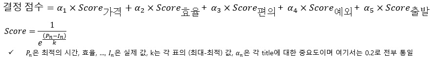
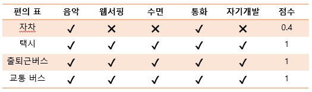
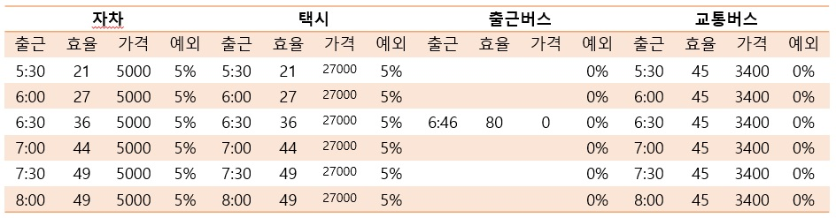
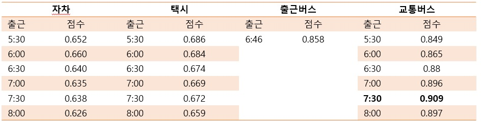

# Commute_Calculator

### 출퇴근 계산기로 아래와 같은 계산식을 가지고 있다.


### 단위 표는 다음과 같다.


### 편의 점수 표는 다음과 같다.


### 예시
저자의 경우 다음과 같은 표를 얻을 수 있고




해당 값에 대한 결과 값은 다음과 같이 도출할 수 있다.



## Requirements
math   
argparse  
python

## implementation
```
python calculator.py --price 5 --time 21 --Convenience 0.4 --S_time 330 --exception 0.05
```

or 

```
all_calculator.sh
```